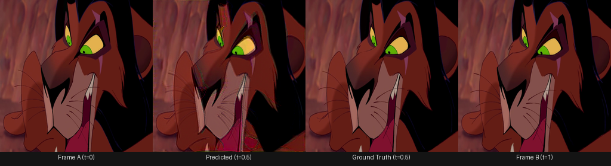
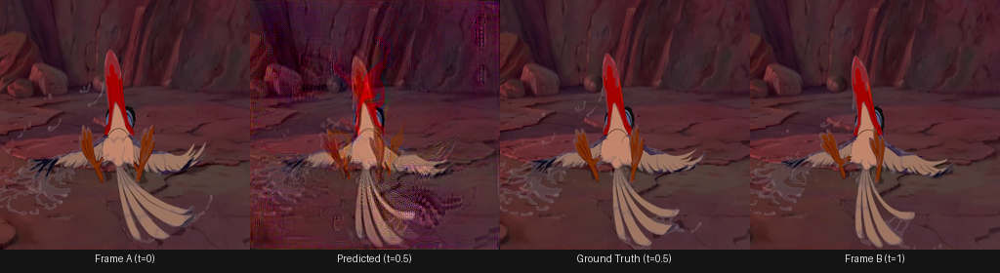

# Anime Frame Interpolation

Given two consecutive anime frames, predicts the missing middle frame at t=0.5.

Fine-tuned on ATD-12K with a distance-transform guided refinement network designed
specifically for anime's flat colour regions and sharp line art.

---

## Demo

**Medium difficulty — Deformation motion (Speaking)**



**Hard difficulty — Large displacement motion (Flying)**



*Ghosting on fast-moving wing feathers is expected at this difficulty level —
large displacement exceeds what the flow estimator can resolve cleanly.*

---

## Results

Evaluated on ATD-12K test set (2,000 triplets), split by difficulty level.
Primary metric is LPIPS (perceptual quality). Lower LPIPS = better.

| Split | Baseline PSNR | Ours PSNR | Baseline LPIPS | Ours LPIPS |
|---|---|---|---|---|
| Easy | 22.81 | **25.54** | 0.2218 | **0.1505** |
| Medium | 20.86 | **23.37** | 0.2738 | **0.2028** |
| Hard | 19.24 | **21.54** | 0.3752 | **0.3041** |
| **Overall** | 21.18 | **23.72** | 0.2818 | **0.2107** |

**+2.54 dB PSNR and -0.071 LPIPS improvement over baseline RIFE across all difficulty levels.**

Baseline is IFNet (pretrained RIFE) without the refinement stage.

---

## Architecture
Frame A ──┐
├─→ IFNet (frozen) ──→ coarse merged frame ──┐
Frame B ──┘         │                                    ├─→ UnetWithDistance ──→ refined frame
└─→ flow, mask, warped frames ───────┘
dist_a ────────────────────────────────────────────────────────────────────────────────────────→ ┘
dist_b ────────────────────────────────────────────────────────────────────────────────────────→ ┘

**Why two stages?**

Standard frame interpolation fails on anime because:
1. Flat colour regions have no texture — optical flow has nothing to grip onto (aperture problem)
2. Sharp line art produces colour bleeding when pixels are warped across hard boundaries

**IFNet** handles motion estimation. Pretrained on Vimeo-90K real footage, frozen during fine-tuning.

**UnetWithDistance** is a refinement network with one key modification: it takes distance
transform maps of both input frames as extra input channels. A distance transform map assigns
each pixel its Euclidean distance to the nearest edge — large values deep inside flat colour
regions, small values near outlines. This explicitly tells the refinement network where the
dangerous flat regions are.

The distance map channels are zero-initialised so the network starts behaving identically to
baseline RIFE. Training on ATD-12K then teaches it to use the distance information.

---

## Why LPIPS over PSNR?

ATD-12K contains smear frames — deliberate animator exaggerations for conveying speed.
A model that produces a smooth, natural-looking interpolation will score *lower* PSNR
than one that reproduces the smear, because the ground truth middle frame is the smear.
LPIPS correlates better with human perception of quality on these frames.

This is why we report both metrics and explain the disagreement rather than averaging over everything.

---

## Dataset

**ATD-12K** (Siyao et al., CVPR 2021) — 12,000 animation frame triplets from 30 films.
Test set is annotated with three difficulty levels based on motion magnitude and occlusion.

- Train: 10,000 triplets
- Test: 2,000 triplets (798 easy / 634 medium / 568 hard)

---

## Training

Only UnetWithDistance is trained. IFNet is frozen throughout.

- **Loss:** LPIPS (weight 1.0) + L1 (weight 0.1)
- **Optimiser:** AdamW, lr=1e-4, weight_decay=1e-4
- **Scheduler:** Cosine annealing
- **Epochs:** 4 (hardware constrained — M1 Mac)
- **Batch size:** 4, image size 256×256

Loss curve:

| Epoch | Total Loss | LPIPS | L1 |
|---|---|---|---|
| 1 | 0.2740 | 0.2697 | 0.0429 |
| 2 | 0.2549 | 0.2510 | 0.0384 |
| 3 | 0.2255 | 0.2223 | 0.0328 |
| 4 | 0.2082 | 0.2050 | 0.0316 |

---

## Installation

```bash
git clone https://github.com/adityapatil371/anime-interp.git
cd anime-interp
python3.11 -m venv venv
source venv/bin/activate
pip install -r requirements.txt
```

Download pretrained weights:

```bash
# IFNet pretrained weights
python3 -c "
from huggingface_hub import hf_hub_download
import shutil
path = hf_hub_download(repo_id='jbilcke-hf/varnish', filename='rife/flownet.pkl')
shutil.copy(path, 'checkpoints/flownet.pkl')
"
```

Download fine-tuned UnetWithDistance weights:

```bash
wget https://github.com/adityapatil371/anime-interp/releases/download/v1.0/unet_best.pth -P checkpoints/
```

---

## Usage

**Interpolate two frames:**

```bash
python scripts/interpolate.py \
    --frame-a input/frame_a.png \
    --frame-b input/frame_b.png \
    --output interpolated.png
```

**Generate comparison image:**

```bash
python app.py \
    --triplet-dir data/datasets/test_2k_540p/Disney_v4_0_000024_s2 \
    --output comparison.png
```

**Evaluate on test set:**

```bash
python scripts/evaluate.py --unet-checkpoint checkpoints/unet_best.pth
```

**Train from scratch:**

```bash
python scripts/precompute_distances.py --split both
python scripts/train.py --epochs 15 --batch-size 4 --num-workers 4
```

---

## Limitations

- Trained for 4 epochs due to hardware constraints (M1 Mac thermal throttling).
  Further training would likely improve hard frame results.
- At 256×256 resolution. Higher resolution would improve fine detail preservation.
- Large displacement motion (fast limb movement) still produces ghosting artifacts
  — this is a fundamental limitation of flow-based interpolation, not specific to this model.

---

## What I Would Do With More Compute

- Train for the full 15 epochs
- Add perceptual loss on edge maps specifically (weight flat regions more heavily)
- Train at 512×512 resolution
- Compare against AnimeInterp (CVPR 2021) and EISAI (ECCV 2022) on the same test set

---

## References

- RIFE: Huang et al., ECCV 2022 — Real-Time Intermediate Flow Estimation
- AnimeInterp: Siyao et al., CVPR 2021 — Deep Animation Video Interpolation in the Wild
- EISAI: Chen & Zwicker, ECCV 2022 — Improving the Perceptual Quality of 2D Animation Interpolation
- LPIPS: Zhang et al., CVPR 2018 — The Unreasonable Effectiveness of Deep Features as a Perceptual Metric